<!-- markdownlint-disable MD033 MD026 -->

<section class="hero hero-maker">
  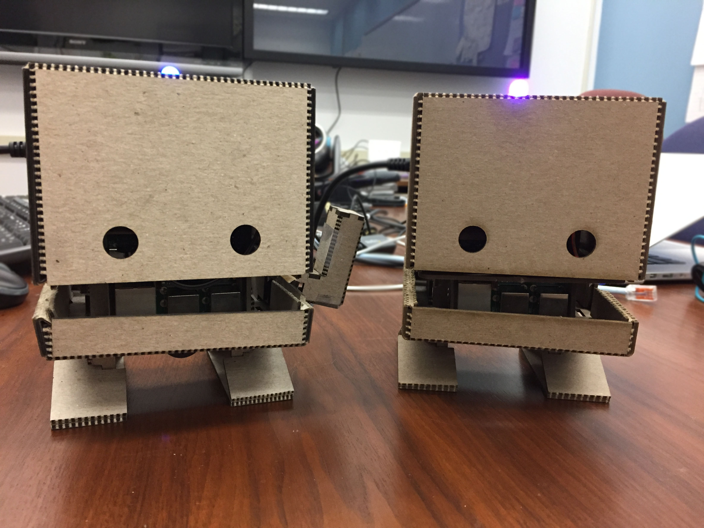
  <h1>TJBot: Community Edition</h1>
  
A DIY open source robot for makers, students, and educators.

  
🖖 This project was forked from the <a href="https://github.com/ibmtjbot/tjbot">original IBM TJBot repository</a> to keep TJBot up-to-date for evolving Raspberry Pi hardware and software.

</section>

## Hello, I'm TJBot!

I am a small, open-source DIY robot that you can 3D print or laser cut. My body houses a Raspberry Pi computer, a small speaker, an LED, a microphone, a camera, and a servo motor that lets me wave my arm. I was designed for students and makers of all ages to showcase the cool applications that could be built with AI.

## Get started

  <article class="section-card">
    <h3>1. Download</h3>
    
Get the files you need to 3D-print or laser cut your TJBot's body.

    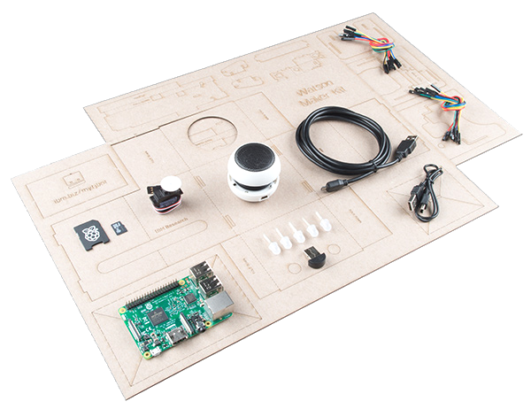
    <a class="button button-secondary" href="https://github.com/tjbot-ce/tjbot-body/releases">📦 Download TJBot</a>
  </article>
  <article class="section-card">
    <h3>2. Build</h3>
    
TJBot needs a few electronics components to come to life, including:

    <ul class="kit-list">
      <li><strong>🥧 Raspberry Pi</strong> - TJBot works best with a Raspberry Pi 3B, 3B+, 4, or 5</li>
      <li><strong>💾 Storage </strong> - Micro SD card or USB SSD drive</li>
      <li><strong>💡 LED</strong> - NeoPixel or Common Anode</li>
      <li><strong>🎙️ Mini USB microphone</strong></li>
      <li><strong>🔊 Mini speaker</strong></li>
      <li><strong>🦾 Micro servo (SG90)</strong></li>
      <li><strong>📷 Camera Module</strong> (optional)</li>
    </ul>
    <a class="button button-secondary" href="https://github.com/tjbot-ce/tjbot/wiki/Build-TJBot">🏗️ Build TJBot</a>
  </article>
  <article class="section-card">
    <h3>3. Bring to Life</h3>
    
Install the software necessary for bringing your TJBot to life.

    <a class="button button-secondary" href="https://github.com/tjbot-ce/tjbot/wiki/Bring-TJBot-to-Life">💾 Install TJBot</a>
  </article>
  <article class="section-card">
    <h3>3. Play</h3>
    
Run TJBot's recipes to interact and play games with TJBot.

    <a class="button button-secondary" href="https://github.com/tjbot-ce/tjbot/wiki/Play-with-TJBot">🤖 Play with TJBot</a>
  </article>

## Contribute to TJBot

TJBot: Community Edition is open source and contribution-friendly. Check out our [GitHub organization](https://github.com/tjbot-ce) and our primary source repositories.

  <article class="repo-card">
    <h3><a href="https://github.com/tjbot-ce/tjbot">tjbot</a></h3>
    
Core TJBot recipes and tooling.

    <a class="button button-secondary" href="https://github.com/tjbot-ce/tjbot">View Repository</a>
  </article>

  <article class="repo-card">
    <h3><a href="https://github.com/tjbot-ce/node-tjbotlib">node-tjbotlib</a></h3>
    
TypeScript library for writing Node.js TJBot recipes.

    <a class="button button-secondary" href="https://github.com/tjbot-ce/node-tjbotlib">View Repository</a>
  </article>

  <article class="repo-card">
    <h3><a href="https://github.com/tjbot-ce/python-tjbotlib">python-tjbotlib</a></h3>
    
Python library for writing TJBot recipes.

    <a class="button button-secondary" href="https://github.com/tjbot-ce/python-tjbotlib">View Repository</a>
  </article>

## #tjbot Gallery

  <figure class="gallery-item gallery-item-image">
    <button type="button" class="gallery-image-button" data-gallery-image="assets/images/tj-and-friends.jpg" data-gallery-alt="TJBot and friends">
      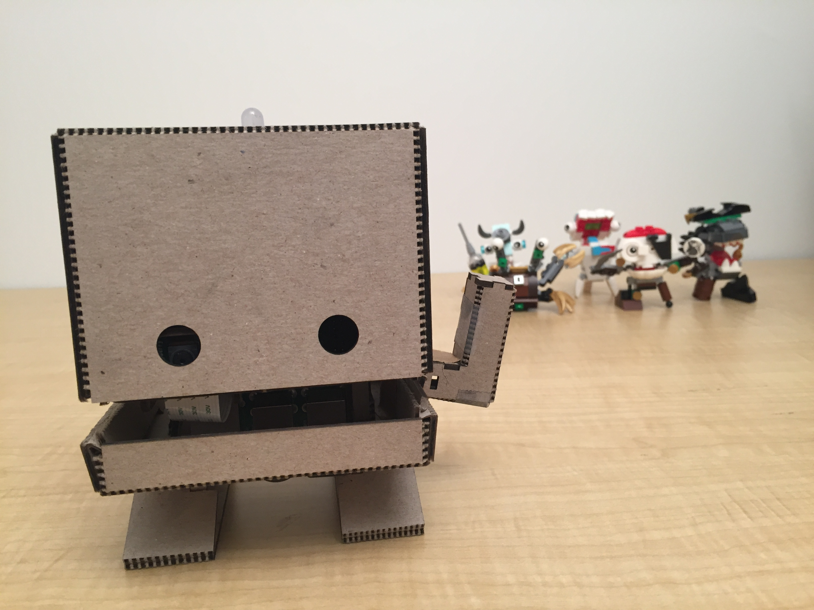
    </button>
  </figure>

  <figure class="gallery-item gallery-item-image">
    <button type="button" class="gallery-image-button" data-gallery-image="assets/images/tj-and-friends.jpg" data-gallery-alt="Blue TJBot">
      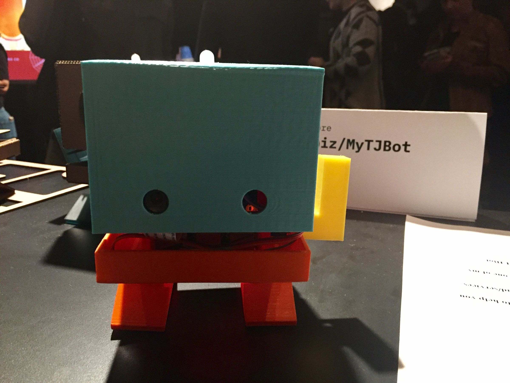
    </button>
  </figure>

  <figure class="gallery-item gallery-item-image">
    <button type="button" class="gallery-image-button" data-gallery-image="assets/images/tj-darth.jpg" data-gallery-alt="Darth TJ and friends">
      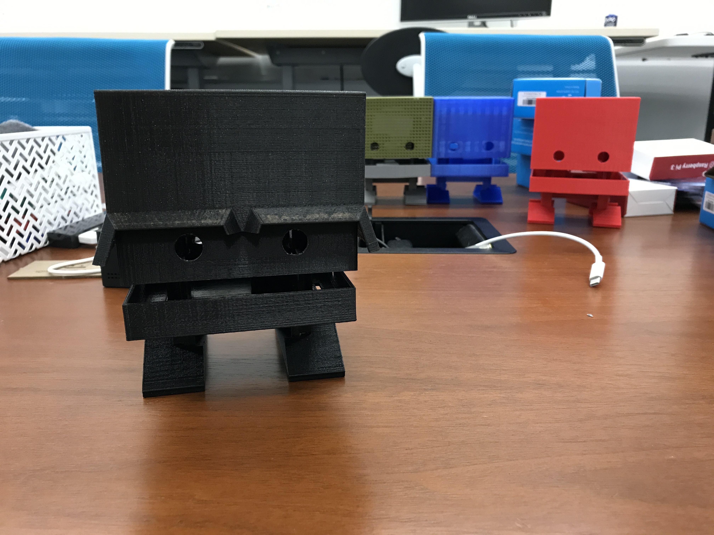
    </button>
  </figure>

  <figure class="gallery-item gallery-item-image">
    <button type="button" class="gallery-image-button" data-gallery-image="assets/images/tj-giant.jpg" data-gallery-alt="Giant TJBot posing with creator Maryam Ashoori at CHI 2017">
      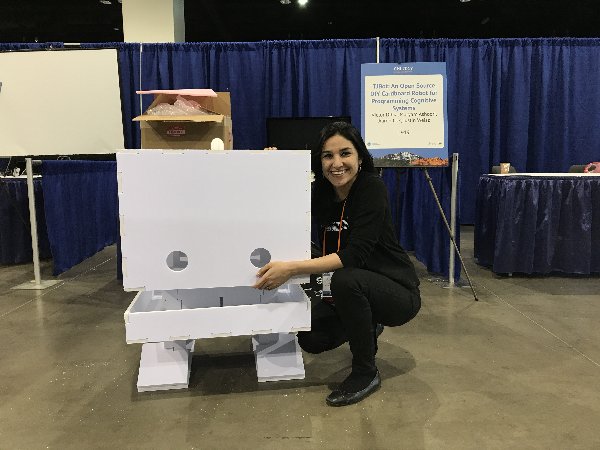
    </button>
  </figure>

  <figure class="gallery-item gallery-item-image">
    <button type="button" class="gallery-image-button" data-gallery-image="assets/images/tj-glasses.jpg" data-gallery-alt="TJBot with glasses">
      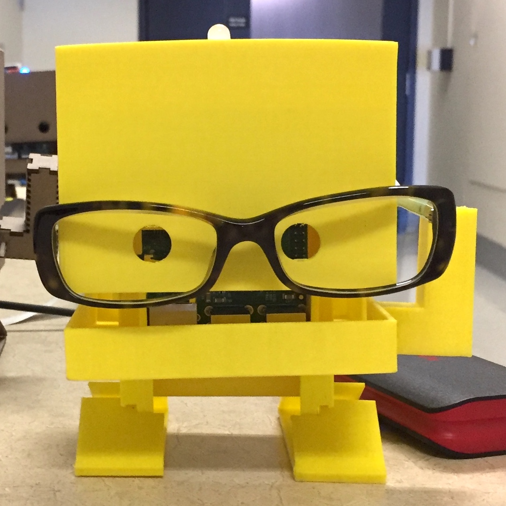
    </button>
  </figure>

  <figure class="gallery-item gallery-item-image">
    <button type="button" class="gallery-image-button" data-gallery-image="assets/images/tj-headset.jpg" data-gallery-alt="TJBot with headset">
      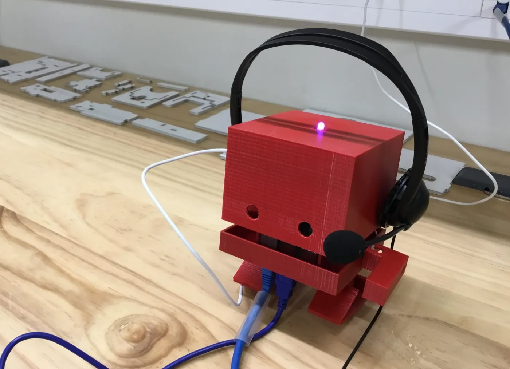
    </button>
  </figure>

  <figure class="gallery-item gallery-item-image">
    <button type="button" class="gallery-image-button" data-gallery-image="assets/images/tj-holidays.jpg" data-gallery-alt="Happy holidays from TJBot!">
      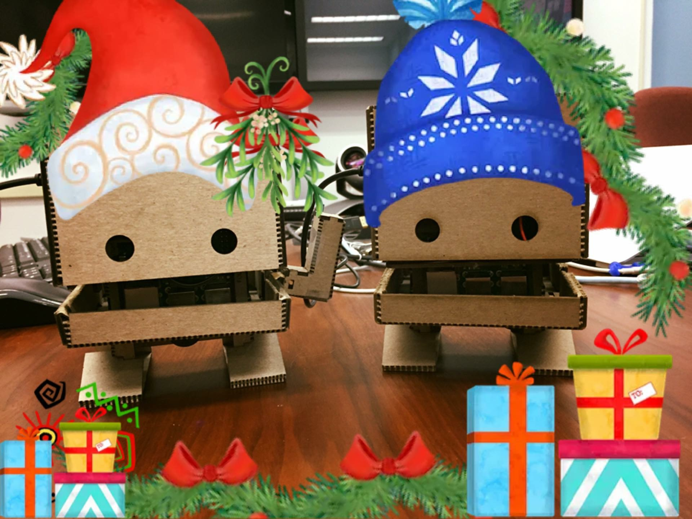
    </button>
  </figure>

  <figure class="gallery-item gallery-item-image">
    <button type="button" class="gallery-image-button" data-gallery-image="assets/images/tj-mustache.jpg" data-gallery-alt="TJBot with mustache">
      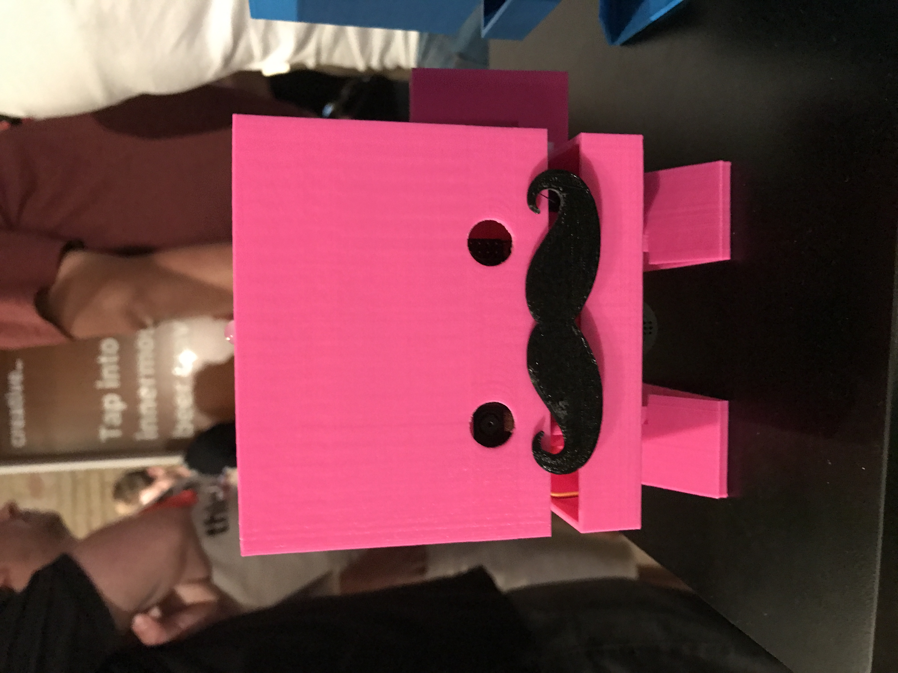
    </button>
  </figure>

  <figure class="gallery-item gallery-item-image">
    <button type="button" class="gallery-image-button" data-gallery-image="assets/images/tj-pyramid.jpg" data-gallery-alt="A pyramid of TJBots">
      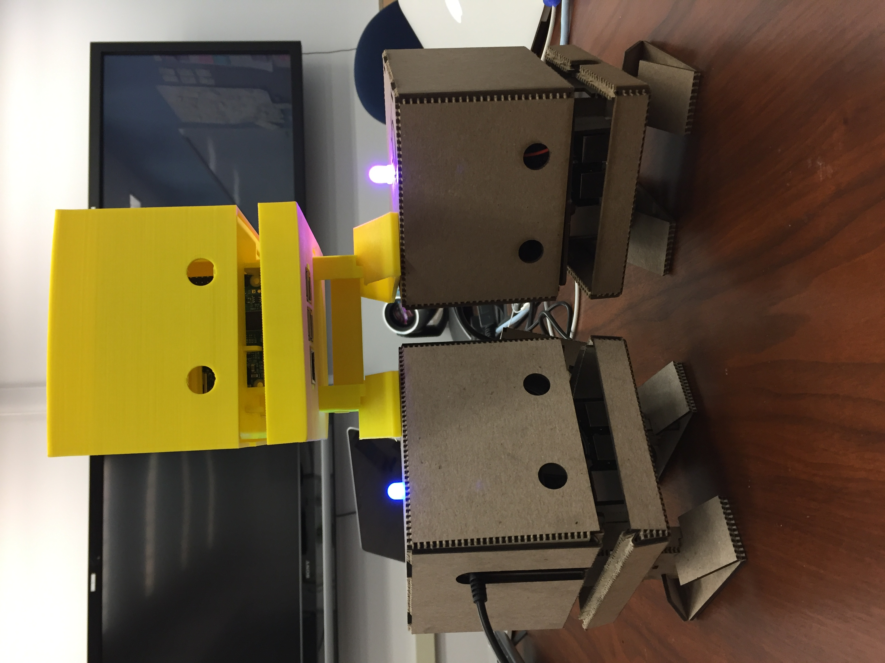
    </button>
  </figure>

  <figure class="gallery-item gallery-item-image">
    <button type="button" class="gallery-image-button" data-gallery-image="assets/images/tj-sxsw.jpg" data-gallery-alt="Giant TJBot posing with creator Maryam Ashoori at SXSW 2017">
      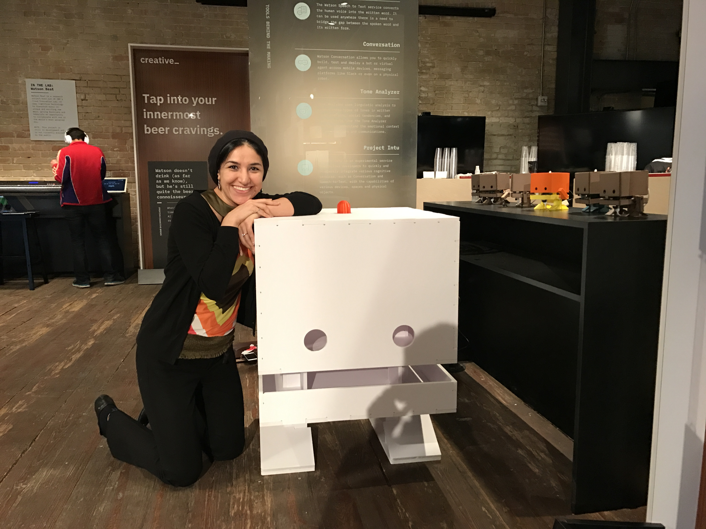
    </button>
  </figure>

  <figure class="gallery-item gallery-item-video">
    

      <iframe src="https://www.youtube.com/embed/yLKCBPdVdKg?si=rOWqdjXwVGofof3A" title="TJBot: An Open Source DIY Robot for Programming Cognitive Systems" frameborder="0" allow="accelerometer; autoplay; clipboard-write; encrypted-media; gyroscope; picture-in-picture; web-share" referrerpolicy="strict-origin-when-cross-origin" allowfullscreen></iframe>
    

    <figcaption>TJBot: An Open Source DIY Robot for Programming Cognitive Systems</figcaption>
  </figure>

  <figure class="gallery-item gallery-item-video">
    

      <iframe src="https://www.youtube.com/embed/bLt3Cf2Ui3o?si=gAh4ADog-uqEVZSG" title="TJBot Assembly" frameborder="0" allow="accelerometer; autoplay; clipboard-write; encrypted-media; gyroscope; picture-in-picture; web-share" referrerpolicy="strict-origin-when-cross-origin" allowfullscreen></iframe>
    

    <figcaption>TJBot Assembly</figcaption>
  </figure>

## Need help?

If you need help with TJBot: Community Edition, please [open an issue](https://github.com/tjbot-ce/tjbot/issues) in our code repository.

<!-- markdownlint-enable MD033 MD026 -->
